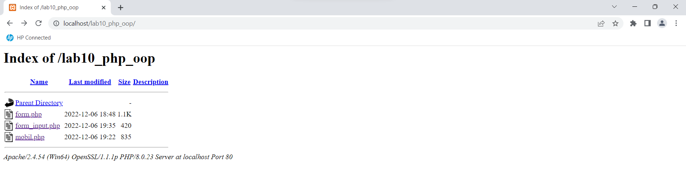
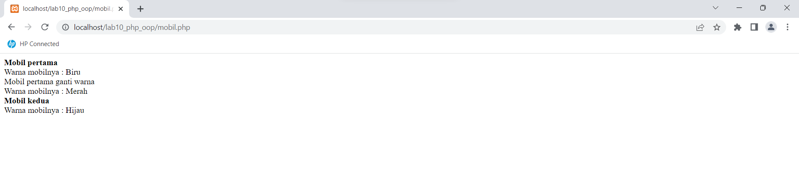
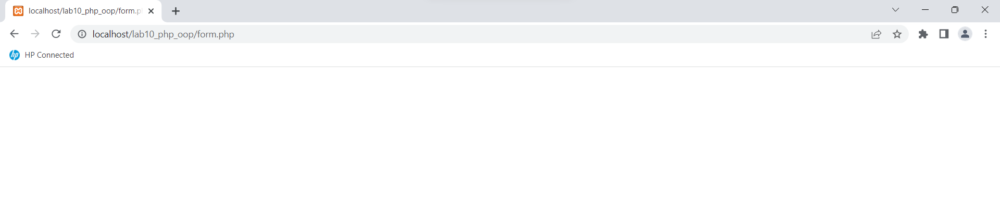
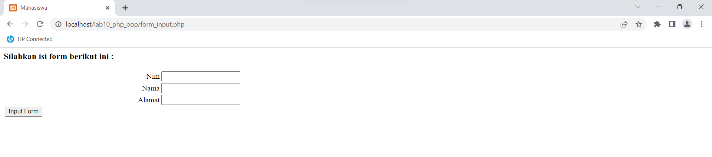

# Lab10Web
# DHEA GITAWIJAYA
# 312110098
# TI.21.B.1

# Lab10Web
OOP
# Langkah - langkah Praktikum

## 1.) BUAT FILE BARU DENGAN NAMA mobil.php dengan vscode, lalu run

## 2.) BUAT FILE BARU DENGAN NAMA form.php dengan vscode, lalu run

## 3.) BUAT FILE BARU DENGAN NAMA form_input.php dengan vscode, lalu run

